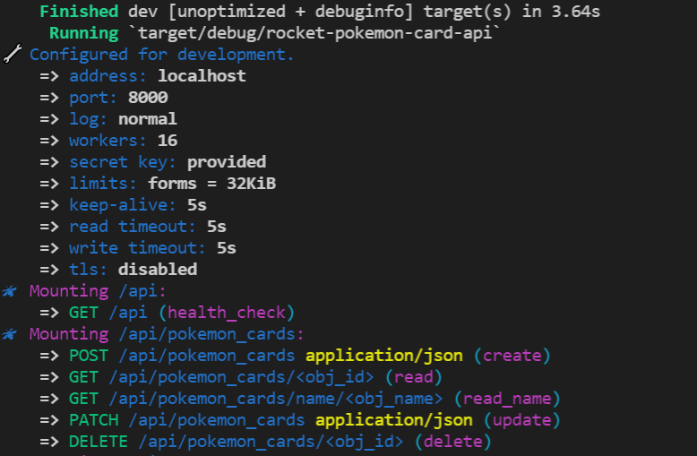

# Pokemon card api using Rust and Rocket

This project is a part of [e-monkeys.tech](https://github.com/e-monkeys-tech/e-monkeys.tech) website building project. Is still under development.
It is freely-inspired by opinionated template [rust-rocket-template](https://github.com/GDGVIT/rust-rocket-template).

The purpose is designing atomic api models (here for a pokemon_card object and in future to implement a selling interface for our playing cards in https://e-monkeys.tech/cards/pokemon/shop).

Refer to TODO section to see futures improvements.

## Features

- [x] Diesel - ORM for SQL databases
- [x] Sample CRUD for a table  
- [x] Easy error handling and CORS 
- [x] Unit tests

## Usage

* Pre-requisites:
	-  [Rust _nightly_](https://rustup.rs)
	-  [Diesel CLI](http://diesel.rs/guides/getting-started/)

* Run all pending DB migrations

```bash
diesel migration run
```

* Start the server
```bash
cargo run
```


## Examples

GET /api/pokemon_cards/<ID>
```bash
$ curl -X GET http://localhost:8000/api/pokemon_cards/7c64fe5c-ad99-4d6a-922b-9723bc08a86e | jq

{
  "id": "7c64fe5c-ad99-4d6a-922b-9723bc08a86e",
  "type_item": "Carte",
  "keytag": "Pokemon",
  "product_state": "Neuve",
  "lang_edition": "VFR",
  "subcollection": "Regne_de_Glace",
  "collection_name": "Epee_et_Bouclier",
  "collection_str_id": "EB06",
  "pokemon_str_id": "33/198",
  "pokemon_description": "Morphéo_Forme_Eau_de_Pluie_REVERSE",
  "is_available": true
}
```

GET /api/pokemon_cards/name/<String>
```bash
$ curl -X GET http://localhost:8000/api/pokemon_cards/name/Racaillou_d\'Alola | jq

{
  "id": "fc263dd0-785f-4b57-a22a-b4fe0219ca9e",
  "type_item": "Carte",
  "keytag": "Pokemon",
  "product_state": "Neuve",
  "lang_edition": "VFR",
  "subcollection": "Gardiens_Ascendants",
  "collection_name": "Soleil_et_Lune",
  "collection_str_id": "SL2",
  "pokemon_str_id": "40/145",
  "pokemon_description": "Racaillou_d'Alola",
  "is_available": true
}
```

POST /api/pokemon_cards/

*Note that 'id' property is automatically created during a call to method* **POST /api/pokemon_cards application/json (create)**
```bash
$ curl -d '{
  	"type_item": "Carte",
  	"keytag": "Pokemon",
  	"product_state": "Neuve",
  	"lang_edition": "VFR",
  	"subcollection": "Regne_de_Glace",
  	"collection_name": "Epee_et_Bouclier",
  	"collection_str_id": "EB06",
  	"pokemon_str_id": "170/198",
  	"pokemon_description": "Artikodin_de_Galar_V_Full_Art",
  	"is_available": true
}' -H "Content-Type: application/json" -X POST http://localhost:8000/api/pokemon_cards | jq

{
  "id": "4082eb06-1c4e-4027-bc2a-961659dffd67",
  "type_item": "Carte",
  "keytag": "Pokemon",
  "product_state": "Neuve",
  "lang_edition": "VFR",
  "subcollection": "Regne_de_Glace",
  "collection_name": "Epee_et_Bouclier",
  "collection_str_id": "EB06",
  "pokemon_str_id": "170/198",
  "pokemon_description": "Artikodin_de_Galar_V_Full_Art",
  "is_available": true
}

curl -X GET http://localhost:8000/api/pokemon_cards/name/Artikodin_de_Galar_V_Full_Art | jq .id
"4082eb06-1c4e-4027-bc2a-961659dffd67"
```

DELETE /api/pokemon_cards/<obj_id>
```bash
curl -X DELETE http://localhost:8000/api/pokemon_cards/4082eb06-1c4e-4027-bc2a-961659dffd67
{"id":"4082eb06-1c4e-4027-bc2a-961659dffd67","type_item":"Carte","keytag":"Pokemon","product_state":"Neuve","lang_edition":"VFR","subcollection":"Regne_de_Glace","collection_name":"Epee_et_Bouclier","collection_str_id":"EB06","pokemon_str_id":"170/198","pokemon_description":"Artikodin_de_Galar_V_Full_Art","is_available":true}
```

<p align="center">
Made with :heart: by <a href="https://github.com/e-monkeys-tech">e-monkeys.tech</a>
</p>
